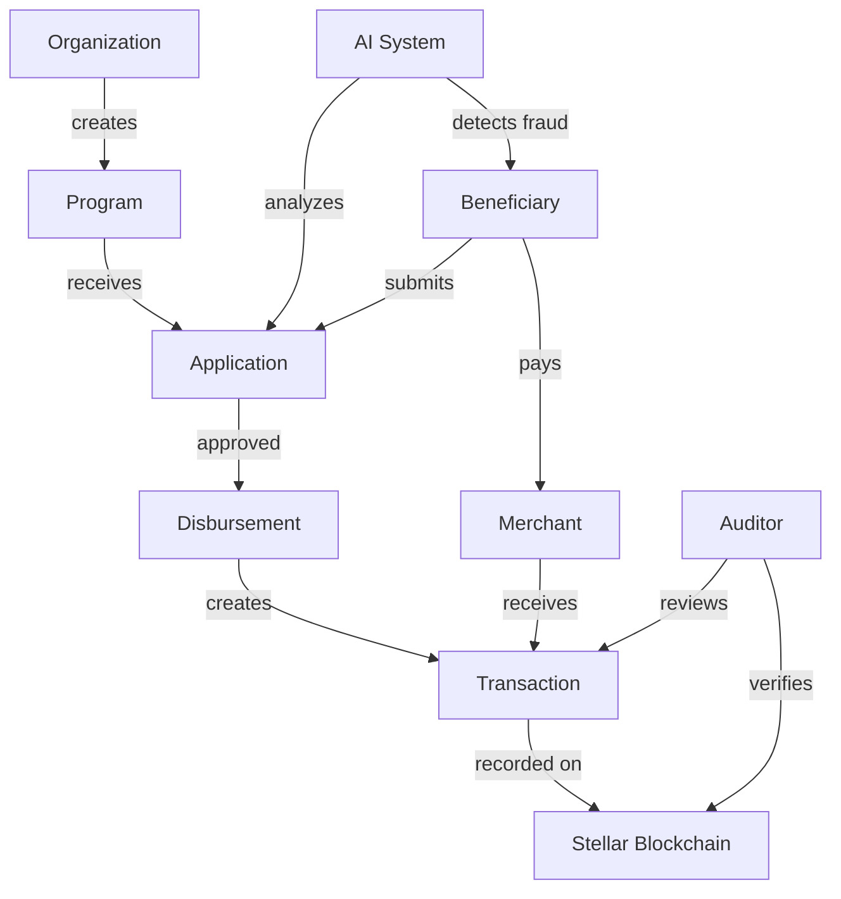
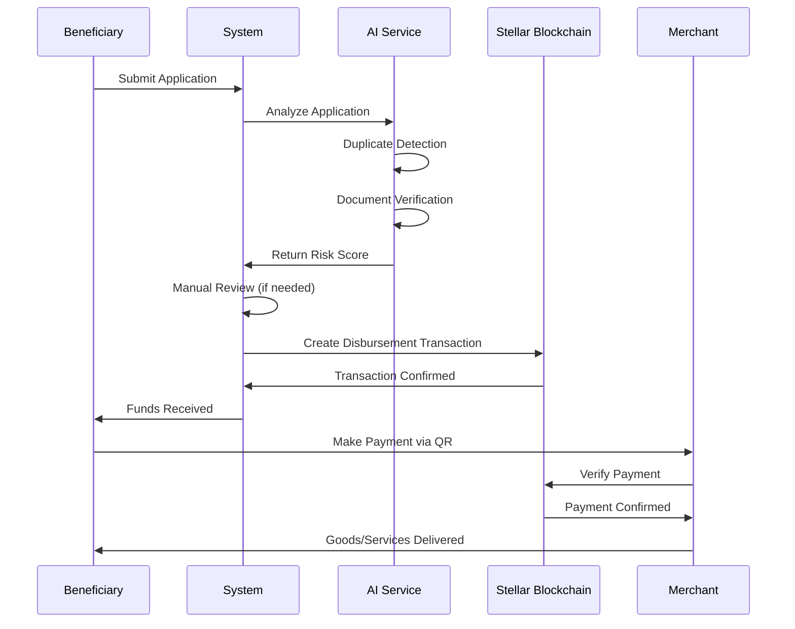

# BayanFi Entity Relationship Diagram

## Complete ER Diagram (Mermaid)

```mermaid
erDiagram
    User ||--o{ OrganizationMember : "has"
    User ||--o| Beneficiary : "is"
    User ||--o| Merchant : "is"
    User ||--o{ Wallet : "owns"
    User ||--o{ Session : "has"
    User ||--o{ Notification : "receives"
    User ||--o{ AuditLog : "performs"
    
    Organization ||--o{ OrganizationMember : "has"
    Organization ||--o{ Program : "creates"
    Organization ||--o{ Setting : "configures"
    User ||--o{ Organization : "verifies"
    
    Program ||--o{ Application : "receives"
    Program ||--o{ Transaction : "funds"
    Organization ||--o{ Program : "manages"
    
    Beneficiary ||--o{ Application : "submits"
    Application ||--o{ Document : "requires"
    Application ||--o{ Transaction : "generates"
    User ||--o{ Application : "reviews"
    User ||--o{ Application : "approves"
    
    Wallet ||--o{ Transaction : "sends"
    Wallet ||--o{ Transaction : "receives"
    Wallet ||--o| Merchant : "belongs"
    
    Merchant ||--o{ Transaction : "accepts"
    User ||--o{ Merchant : "verifies"
    
    AIAnalysis }o--|| User : "reviewed_by"
    User ||--o{ Setting : "updates"
    
    User {
        uuid id PK
        string email UK
        string passwordHash
        enum role
        string stellarPublicKey UK
        string phone
        boolean isEmailVerified
        boolean isPhoneVerified
        boolean mfaEnabled
        timestamp lastLoginAt
        int loginAttempts
        timestamp lockedUntil
    }
    
    Organization {
        uuid id PK
        string name
        enum type
        string registrationNumber
        string contactEmail
        enum status
        string stellarPublicKey UK
        timestamp verifiedAt
        uuid verifiedById FK
    }
    
    OrganizationMember {
        uuid id PK
        uuid organizationId FK
        uuid userId FK
        enum role
        json permissions
        timestamp joinedAt
    }
    
    Program {
        uuid id PK
        uuid organizationId FK
        string name
        enum type
        decimal budgetAmount
        decimal distributedAmount
        date startDate
        date endDate
        json eligibilityCriteria
        json spendingRestrictions
        enum status
        boolean isEmergency
    }
    
    Beneficiary {
        uuid id PK
        uuid userId FK UK
        string firstName
        string lastName
        date dateOfBirth
        string nationalId
        string city
        string province
        string region
        boolean isPwd
        boolean isSenior
        int householdSize
        decimal monthlyIncome
        enum status
    }
    
    Application {
        uuid id PK
        uuid programId FK
        uuid beneficiaryId FK
        enum status
        decimal requestedAmount
        decimal approvedAmount
        decimal riskScore
        decimal eligibilityScore
        boolean duplicateCheckPassed
        boolean fraudCheckPassed
        timestamp submittedAt
        timestamp disbursedAt
        string disbursementTxHash
    }
    
    Document {
        uuid id PK
        uuid applicationId FK
        string documentType
        string fileUrl
        int fileSize
        boolean isVerified
        decimal aiVerificationScore
        uuid verifiedById FK
    }
    
    Wallet {
        uuid id PK
        uuid userId FK
        string publicKey UK
        string encryptedSecretKey
        enum walletType
        boolean isPrimary
        decimal balanceXlm
        decimal balanceUsdc
        enum status
    }
    
    Transaction {
        uuid id PK
        uuid fromWalletId FK
        uuid toWalletId FK
        uuid programId FK
        uuid applicationId FK
        enum transactionType
        decimal amount
        string assetCode
        string stellarTxHash UK
        enum status
        uuid merchantId FK
    }
    
    Merchant {
        uuid id PK
        uuid userId FK UK
        string businessName
        string registrationNumber
        enum category
        string city
        string province
        uuid walletId FK
        enum status
        decimal totalSales
        int totalTransactions
    }
    
    AIAnalysis {
        uuid id PK
        uuid targetId
        string targetType
        enum analysisType
        string modelName
        decimal score
        enum result
        json details
        uuid reviewedById FK
    }
    
    AuditLog {
        uuid id PK
        uuid userId FK
        string action
        string entityType
        uuid entityId
        json changes
        inet ipAddress
        string status
    }
    
    Notification {
        uuid id PK
        uuid userId FK
        string type
        string title
        string message
        enum priority
        boolean isRead
        timestamp readAt
    }
    
    Session {
        uuid id PK
        uuid userId FK
        string refreshTokenHash UK
        inet ipAddress
        timestamp expiresAt
    }
    
    Setting {
        uuid id PK
        enum scope
        uuid scopeId FK
        string key
        json value
        boolean isEncrypted
    }
```

---

## Simplified Domain Model



---

## Core Relationships

### 1. User Management
- **User** → **Beneficiary**: One-to-one (a user can be a beneficiary)
- **User** → **Merchant**: One-to-one (a user can be a merchant)
- **User** → **OrganizationMember**: One-to-many (a user can belong to multiple organizations)
- **User** → **Wallet**: One-to-many (a user can have multiple wallets)

### 2. Organization Structure
- **Organization** → **Program**: One-to-many (an organization creates multiple programs)
- **Organization** → **OrganizationMember**: One-to-many (an organization has multiple members)
- **User** → **Organization**: Many-to-many (through OrganizationMember)

### 3. Application Flow
- **Program** → **Application**: One-to-many (a program receives multiple applications)
- **Beneficiary** → **Application**: One-to-many (a beneficiary can apply to multiple programs)
- **Application** → **Document**: One-to-many (an application has multiple documents)
- **Application** → **Transaction**: One-to-many (successful application creates disbursement transaction)

### 4. Financial Transactions
- **Wallet** → **Transaction** (from): One-to-many (a wallet sends multiple transactions)
- **Wallet** → **Transaction** (to): One-to-many (a wallet receives multiple transactions)
- **Transaction** → **Merchant**: Many-to-one (transactions can be made to merchants)
- **Transaction** → **Program**: Many-to-one (transactions can be linked to programs)

### 5. AI & Auditing
- **AIAnalysis**: Polymorphic relationship to any entity (target_id + target_type)
- **AuditLog**: Records all system actions with user and entity references
- **Notification**: One-to-many from User (users receive notifications)

---

## Data Flow Diagram



---

## Database Normalization

The schema follows **Third Normal Form (3NF)**:

1. **1NF**: All attributes contain atomic values
2. **2NF**: No partial dependencies (all non-key attributes depend on entire primary key)
3. **3NF**: No transitive dependencies (non-key attributes don't depend on other non-key attributes)

### Denormalization for Performance

Strategic denormalization in specific cases:
- `Program.distributedAmount`: Cached sum for performance
- `Merchant.totalSales`: Cached sum for performance
- `Wallet.balanceXlm`, `Wallet.balanceUsdc`: Cached from blockchain
- `Beneficiary.status`: Derived but cached for fast queries

---

## Indexing Strategy

### Primary Indexes
- All foreign keys automatically indexed
- Unique constraints on email, public keys, hashes

### Composite Indexes
- `(organization_id, user_id)` for organization members
- `(program_id, beneficiary_id)` for applications
- `(user_id, is_read, created_at)` for notifications

### Full-Text Search
- GIN indexes on `name` fields for fast text search
- Used for searching organizations, programs, merchants

### Partial Indexes
- `WHERE deleted_at IS NULL` for soft-deleted records
- `WHERE is_primary = true` for primary wallets

---

## Constraints Summary

| Type | Count | Examples |
|------|-------|----------|
| PRIMARY KEY | 15 | All tables have UUID primary keys |
| FOREIGN KEY | 35+ | All relationships enforced |
| UNIQUE | 12 | email, public_key, tx_hash, etc. |
| CHECK | 8 | Amount > 0, score 0-100, dates |
| NOT NULL | 100+ | Critical fields enforced |
| DEFAULT | 50+ | Sensible defaults for all fields |

---

## Security Considerations

1. **Encrypted Fields**: `nationalId`, `taxId`, `mfaSecret`, `encryptedSecretKey`
2. **Hashed Fields**: `passwordHash`, `refreshTokenHash`, `biometricHash`
3. **Audit Trail**: All changes logged in `audit_logs`
4. **Soft Deletes**: `deleted_at` timestamp for data retention
5. **Row-Level Security**: Implemented in application layer (NestJS guards)
