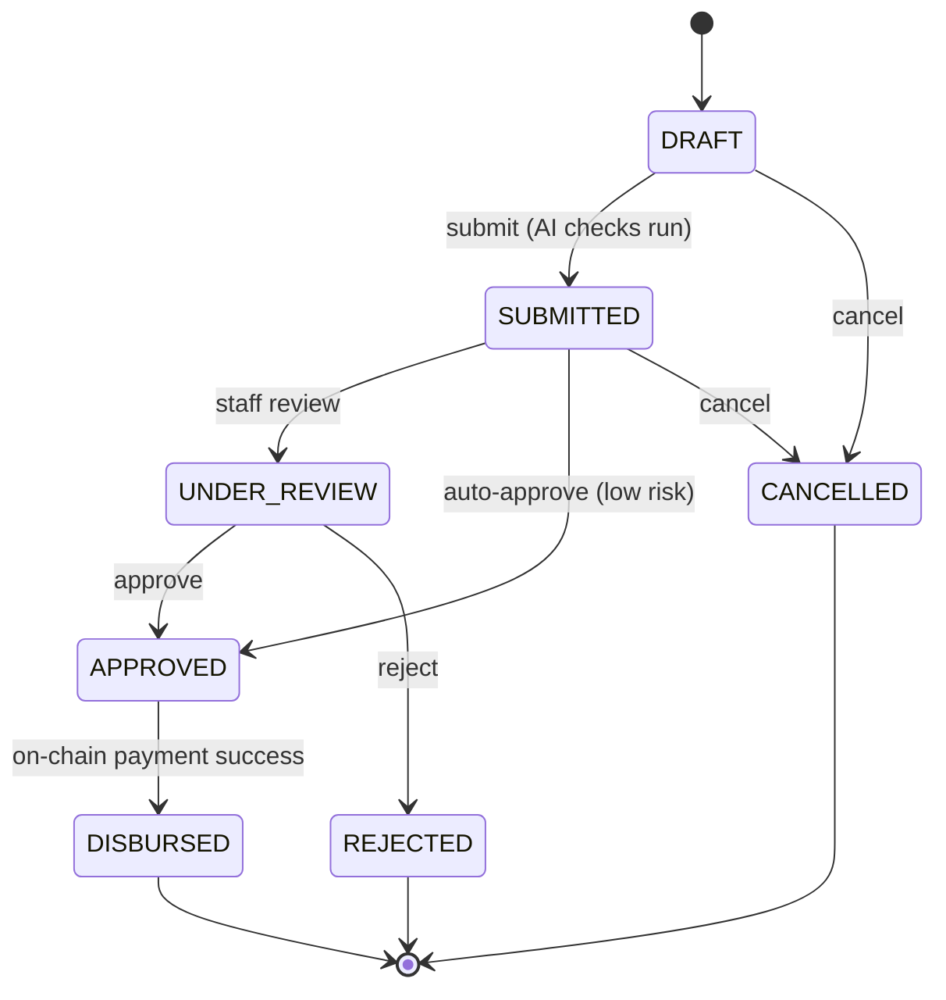
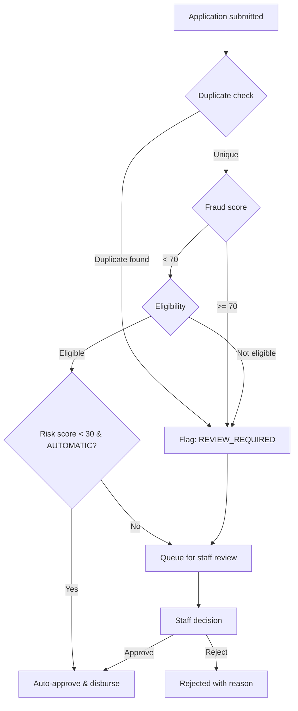
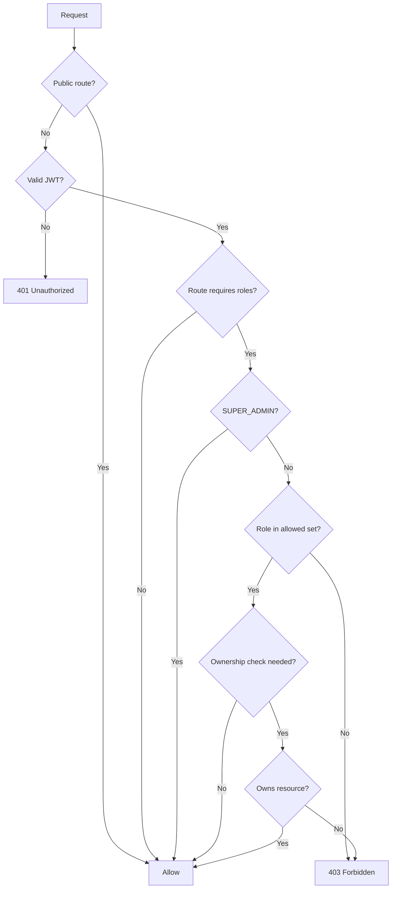
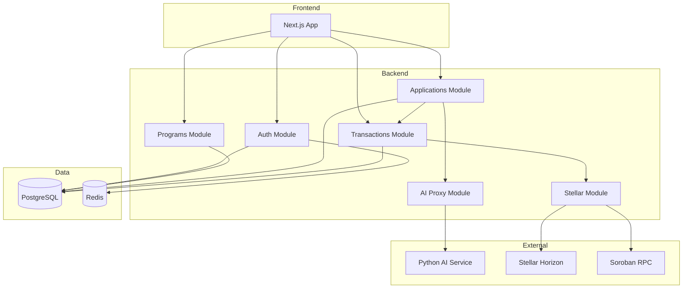
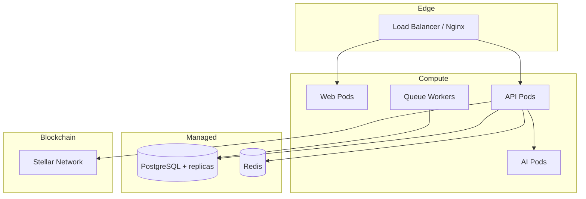

# BayanFi Flowcharts & UML

## Application Lifecycle State Machine

## Fraud Decision Flow

## Program Funding & Disbursement Flow

```mermaid
flowchart LR
    A[Organization verified] --> B[Master Stellar account provisioned]
    B --> C[Create program with budget]
    C --> D[Activate program]
    D --> E[Beneficiaries apply]
    E --> F[AI + staff approval]
    F --> G[Reserve budget atomically]
    G --> H[On-chain disbursement]
    H --> I[Beneficiary wallet funded]
    I --> J[Spend at merchants via QR]
    J --> K[Merchant settlement]
```

## RBAC Authorization Flow

## Component Diagram (UML)

## Deployment Diagram (UML)

