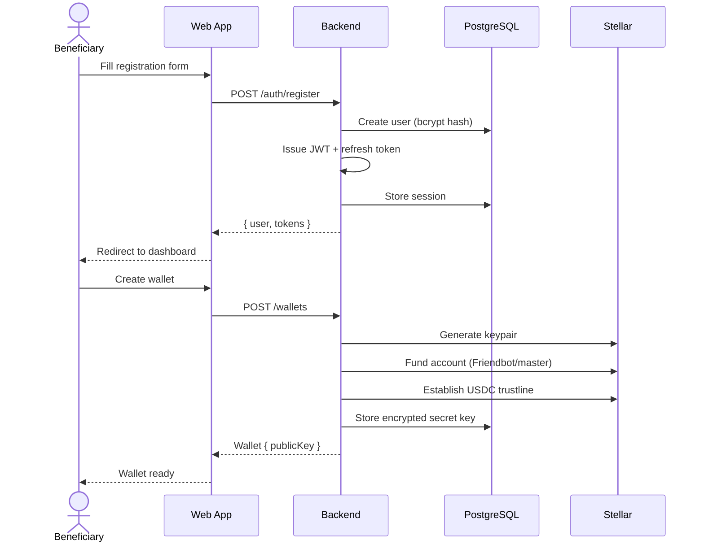
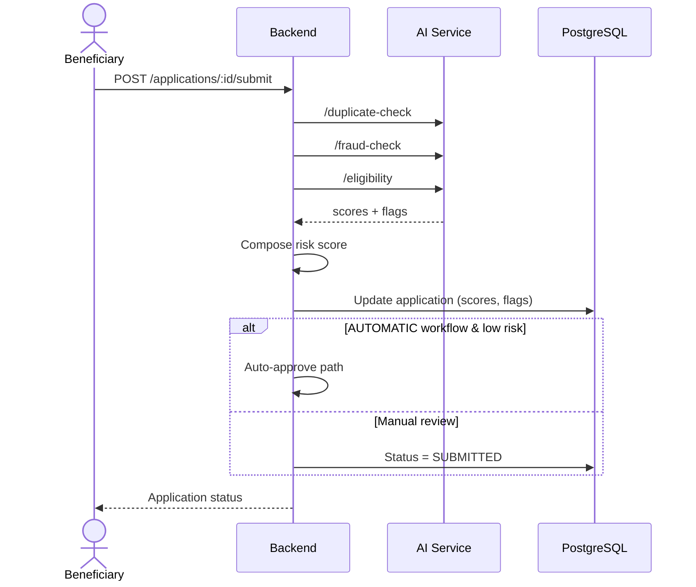
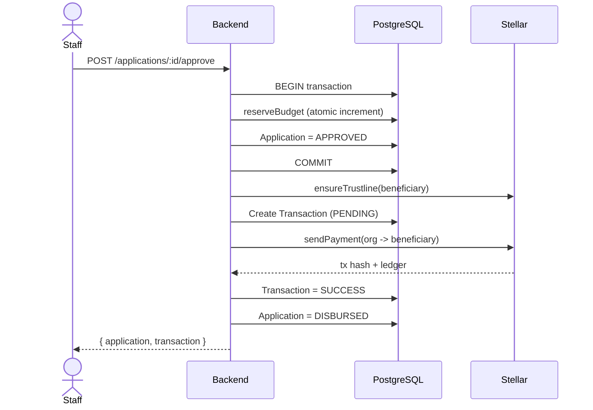
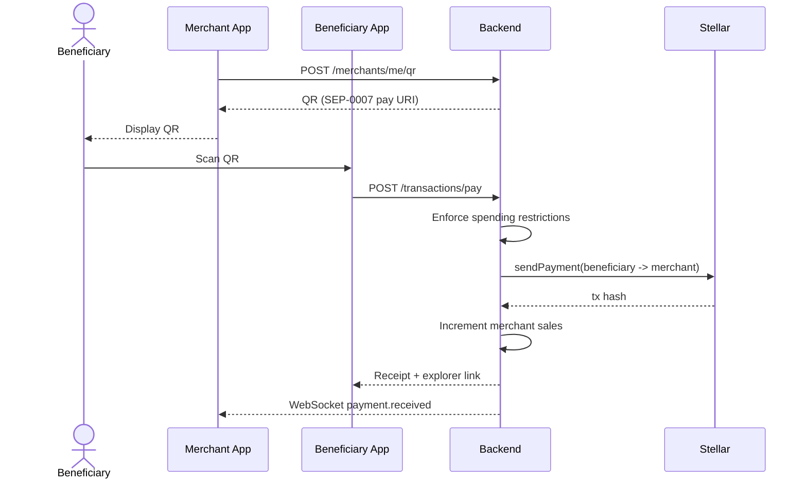
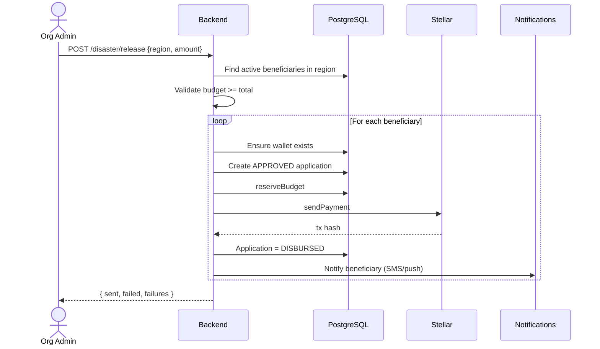
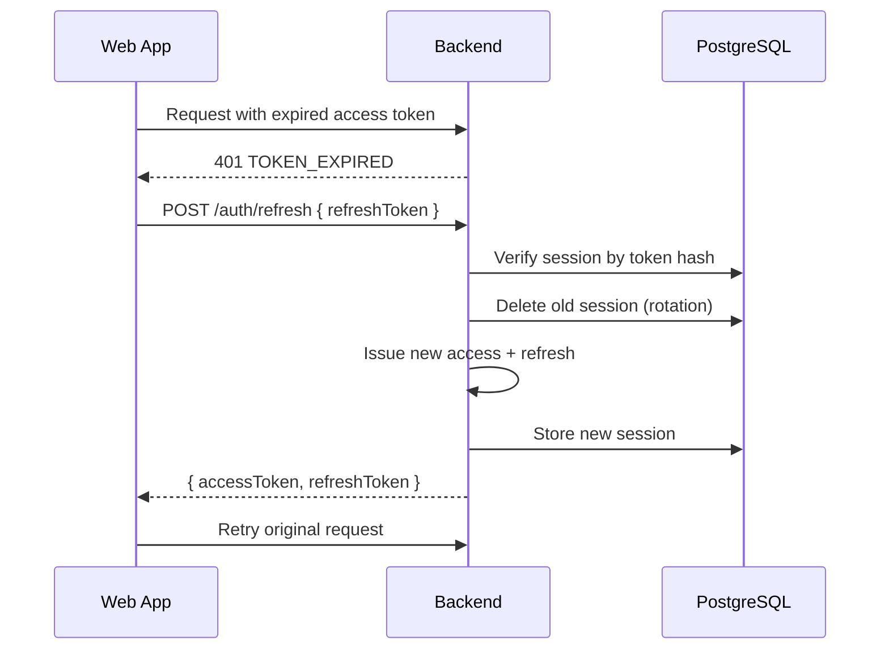

# BayanFi Sequence Diagrams

## 1. User Registration & Wallet Creation

## 2. Application Submission with AI Analysis

## 3. Approval & On-Chain Disbursement

## 4. Merchant QR Payment

## 5. Disaster Emergency Release

## 6. Token Refresh Rotation

