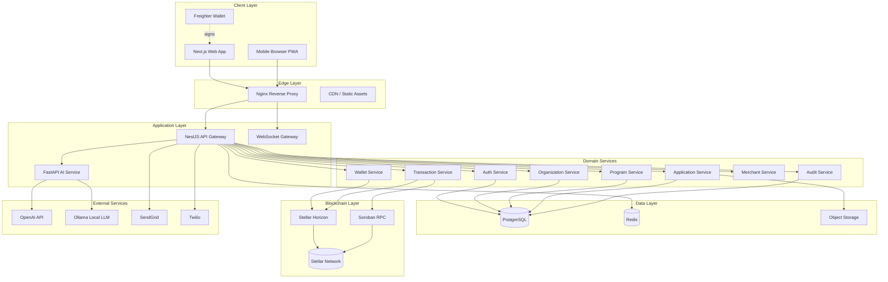
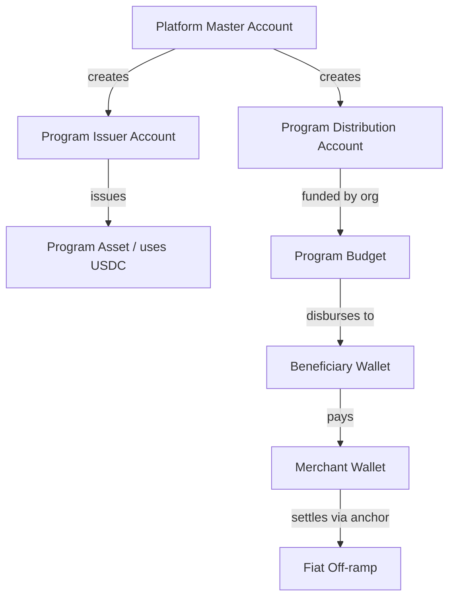
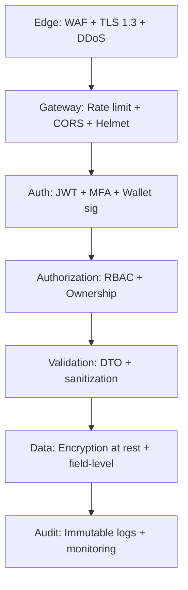
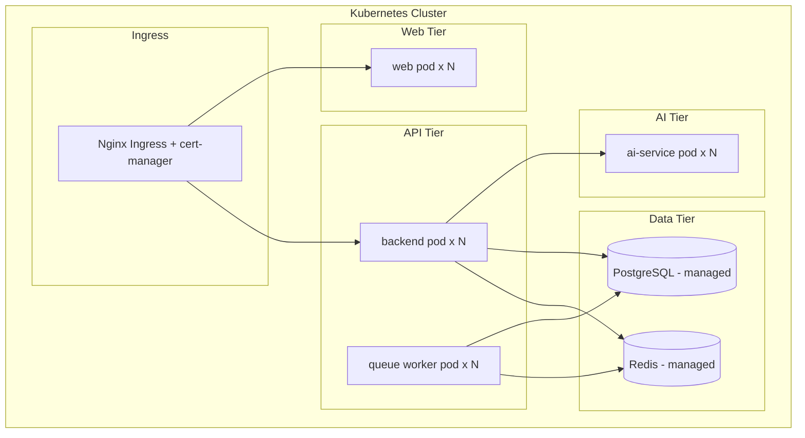

# BayanFi System Architecture

**Version:** 1.0
**Date:** July 11, 2026

---

## 1. High-Level Architecture



---

## 2. Backend Architecture (NestJS)

### 2.1 Module Structure

BayanFi's backend follows a **domain-driven modular monolith** design. Each domain is a self-contained NestJS module that can later be extracted into a microservice.

```
apps/backend/src/
├── main.ts                     # Application bootstrap
├── app.module.ts               # Root module
├── common/                     # Cross-cutting concerns
│   ├── decorators/             # @CurrentUser, @Roles, @Public
│   ├── filters/                # Global exception filter
│   ├── guards/                 # JwtAuthGuard, RolesGuard
│   ├── interceptors/           # Logging, transform, audit
│   ├── pipes/                  # Validation pipe
│   └── middleware/             # Request ID, rate limit
├── config/                     # Configuration modules
├── database/                   # Prisma service + migrations
├── modules/
│   ├── auth/                   # Authentication & authorization
│   ├── users/                  # User management
│   ├── organizations/          # Organization management
│   ├── programs/               # Program management
│   ├── applications/           # Application workflow
│   ├── beneficiaries/          # Beneficiary profiles
│   ├── wallets/                # Wallet management
│   ├── transactions/           # Payment processing
│   ├── merchants/              # Merchant system
│   ├── stellar/                # Stellar integration
│   ├── ai/                     # AI service proxy
│   ├── audit/                  # Audit & compliance
│   ├── disaster/               # Disaster relief mode
│   ├── notifications/          # Notification service
│   └── transparency/           # Public dashboard data
└── queues/                     # Bull queue processors
```

### 2.2 Layered Architecture

Each module follows a consistent 3-layer pattern:

```
Controller (HTTP)  ->  Service (Business Logic)  ->  Repository (Prisma)
     |                        |                            |
   DTOs               Domain entities              Database models
  Guards              External services            Transactions
 Validation           Event emission               Query building
```

### 2.3 Cross-Cutting Concerns

- **Authentication**: Passport JWT strategy with access/refresh rotation
- **Authorization**: `RolesGuard` + `@Roles()` decorator, ownership checks
- **Validation**: `class-validator` DTOs with global `ValidationPipe`
- **Audit**: `AuditInterceptor` records mutations to `audit_logs`
- **Rate limiting**: `@nestjs/throttler` backed by Redis
- **Caching**: Redis via `CacheModule` for read-heavy endpoints
- **Queues**: Bull for async jobs (disbursements, notifications, AI)
- **Logging**: Pino structured logs with correlation IDs
- **Error handling**: Global exception filter -> standard error envelope


---

## 3. Frontend Architecture (Next.js)

### 3.1 App Router Structure

```
apps/web/src/
├── app/
│   ├── (marketing)/            # Public landing pages
│   │   ├── page.tsx            # Landing page
│   │   └── transparency/       # Public transparency dashboard
│   ├── (auth)/                 # Auth flows
│   │   ├── login/
│   │   ├── register/
│   │   └── forgot-password/
│   ├── (dashboard)/            # Authenticated app
│   │   ├── admin/              # Organization admin
│   │   ├── beneficiary/        # Beneficiary dashboard
│   │   ├── merchant/           # Merchant dashboard
│   │   ├── auditor/            # Auditor dashboard
│   │   └── layout.tsx          # Shared dashboard shell
│   ├── api/                    # Route handlers (BFF)
│   ├── layout.tsx              # Root layout
│   └── globals.css
├── components/
│   ├── ui/                     # Shadcn primitives
│   ├── charts/                 # Data visualizations
│   ├── forms/                  # Reusable forms
│   ├── wallet/                 # Wallet connection
│   └── layout/                 # Nav, sidebar, header
├── lib/
│   ├── api/                    # API client (typed)
│   ├── stellar/                # Client-side Stellar helpers
│   ├── auth/                   # Auth context & hooks
│   └── utils/
├── hooks/                      # Custom React hooks
├── stores/                     # Zustand stores
└── types/                      # Shared TS types
```

### 3.2 State Management Strategy

| Concern | Solution |
|---------|----------|
| Server state | TanStack Query (React Query) |
| Client/UI state | Zustand |
| Form state | React Hook Form + Zod |
| Auth state | React Context + secure cookies |
| Real-time | Socket.io client + Query invalidation |

### 3.3 Rendering Strategy

- **Landing / Transparency**: SSG + ISR (public, SEO-critical, cacheable)
- **Dashboards**: CSR with prefetched server components for shell
- **Auth pages**: SSR for security-sensitive redirects
- **PWA**: Service worker for offline wallet access

---

## 4. Stellar Architecture

### 4.1 Why Stellar Is Essential

| Feature | Why Stellar (not a database) |
|---------|------------------------------|
| Fund disbursement | Immutable, publicly verifiable proof of payment |
| Transparency dashboard | Anyone can independently audit on-chain |
| Multi-sig approvals | Native threshold signatures, no custom crypto |
| Cross-org settlement | Trustless value transfer between entities |
| Merchant payments | 3-5s finality, sub-cent fees, no chargebacks |
| Escrow | Soroban smart contracts hold funds trustlessly |
| Financial inclusion | Works for unbanked via anchors + stablecoins |

### 4.2 Account Model



### 4.3 Transaction Flows

**Disbursement (approved application):**
1. Validate program has sufficient balance
2. Ensure beneficiary wallet has trustline to asset (create if needed)
3. Build payment: distribution -> beneficiary
4. For amounts > threshold, collect multi-sig signatures
5. Submit to Horizon, poll for confirmation
6. Persist `stellar_tx_hash`, emit WebSocket event, notify beneficiary

**Merchant payment:**
1. Beneficiary scans merchant QR (wallet + optional amount)
2. Server validates spending restrictions (category, daily limit)
3. Build payment: beneficiary -> merchant
4. Sign with custodial key (or client-side Freighter for non-custodial)
5. Submit, confirm, generate receipt

### 4.4 Soroban Smart Contracts

| Contract | Purpose |
|----------|---------|
| `program_escrow` | Holds program funds; releases on approval conditions |
| `disbursement_rules` | On-chain enforcement of max-per-beneficiary limits |
| `multisig_approval` | Threshold approval for high-value disbursements |
| `spending_policy` | Restricts merchant categories at protocol level |

### 4.5 Key Management

- **Custodial wallets**: Secret keys encrypted with AES-256-GCM, keys stored in KMS/HSM. Envelope encryption with per-wallet data keys.
- **Non-custodial**: Users sign with Freighter; platform never sees secret.
- **Platform accounts**: Managed via HSM, multi-sig for treasury operations.


---

## 5. AI Architecture

### 5.1 Service Design

The AI service is a standalone **Python FastAPI** application. It is stateless, horizontally scalable, and pluggable between OpenAI (cloud) and Ollama (local/private) backends.

```
apps/ai-service/
├── main.py                     # FastAPI app
├── config.py                   # Settings (pydantic)
├── routers/
│   ├── duplicate.py            # Duplicate beneficiary detection
│   ├── fraud.py                # Fraud risk scoring
│   ├── documents.py            # Document verification
│   ├── anomaly.py              # Spending anomaly detection
│   ├── eligibility.py          # Eligibility prediction
│   ├── chat.py                 # Conversational assistant (RAG)
│   └── forecast.py             # Budget forecasting
├── services/
│   ├── llm.py                  # LLM abstraction (OpenAI/Ollama)
│   ├── embeddings.py           # Vector embeddings
│   ├── vision.py               # Document image analysis
│   └── ml_models.py            # Classical ML models
├── models/                     # Saved model artifacts
└── utils/
```

### 5.2 AI Feature Implementations

| Feature | Technique | Why meaningful |
|---------|-----------|----------------|
| Duplicate detection | Fuzzy matching + embedding similarity on name/DOB/biometric | Eliminates ghost beneficiaries |
| Fraud detection | Gradient-boosted classifier on behavioral features | Flags high-risk applications |
| Document verification | Vision model + metadata/EXIF + tamper detection | Catches forged documents |
| Anomaly detection | Isolation Forest on transaction velocity/amount | Detects misuse of funds |
| Eligibility assistant | Rule engine + LLM explanation | Transparent, explainable decisions |
| Chatbot | RAG over program docs + user context | 24/7 multilingual support |
| Budget forecasting | Time-series (Prophet) on historical disbursement | Predicts future fund needs |

### 5.3 Explainability

Every AI decision returns a `score`, a `result` (PASS/FAIL/REVIEW_REQUIRED), and a human-readable `explanation`. No fully automated rejection without a review path for edge cases. All results are logged to `ai_analyses` for audit.

### 5.4 Privacy

- PII is tokenized/hashed before leaving the backend where possible
- Ollama option keeps data fully on-premise for sensitive deployments
- Vector store contains no raw PII, only embeddings + references

---

## 6. Security Architecture

### 6.1 Defense in Depth



### 6.2 Controls Matrix

| Layer | Control |
|-------|---------|
| Transport | TLS 1.3, HSTS, secure cookies |
| Authentication | Bcrypt (10+ rounds), JWT rotation, MFA for admins, account lockout |
| Authorization | RBAC (6 roles), resource ownership, org-scoped access |
| Input | class-validator DTOs, parameterized Prisma queries, output encoding |
| Secrets | KMS/HSM, env injection, no secrets in code |
| Data | AES-256 at rest, field-level encryption for PII |
| Blockchain | Multi-sig for high-value, signature verification |
| Monitoring | Audit logs, anomaly alerts, Sentry, structured logging |
| Compliance | Data Privacy Act, OWASP Top 10, 7-year audit retention |

### 6.3 OWASP Top 10 Mapping

| Risk | Mitigation |
|------|-----------|
| A01 Broken Access Control | RBAC guards + ownership checks + tests |
| A02 Cryptographic Failures | TLS 1.3, AES-256, bcrypt, KMS |
| A03 Injection | Prisma parameterization, DTO validation |
| A04 Insecure Design | Threat modeling, escrow contracts |
| A05 Security Misconfig | Helmet, CSP, hardened Docker images |
| A06 Vulnerable Components | Dependabot, pinned versions, SCA in CI |
| A07 Auth Failures | MFA, lockout, token rotation |
| A08 Data Integrity | Blockchain immutability, signed artifacts |
| A09 Logging Failures | Structured audit logs, alerting |
| A10 SSRF | Allowlist for outbound, no user-controlled URLs |


---

## 7. Deployment Architecture

### 7.1 Environments

| Environment | Stellar Network | Purpose |
|-------------|-----------------|---------|
| Local | Testnet | Development |
| Staging | Testnet | QA, demos, hackathon |
| Production | Mainnet | Live operations |

### 7.2 Container Topology



### 7.3 CI/CD Pipeline

```
push -> GitHub Actions
  -> lint + typecheck
  -> unit tests + coverage gate (80%)
  -> build Docker images
  -> SCA + container scan (Trivy)
  -> push to registry
  -> deploy to staging (auto)
  -> e2e tests
  -> manual approval
  -> deploy to production (blue/green)
```

### 7.4 Scalability

- **Stateless services**: horizontal pod autoscaling on CPU/RPS
- **Database**: read replicas, connection pooling (PgBouncer), monthly partitioning of `audit_logs` and `transactions`
- **Caching**: Redis for sessions, rate limits, hot reads
- **Queues**: Bull workers scale independently for disbursement bursts
- **CDN**: static assets and ISR pages at edge

### 7.5 Observability

| Concern | Tool |
|---------|------|
| Metrics | Prometheus + Grafana |
| Logs | Loki / CloudWatch |
| Traces | OpenTelemetry |
| Errors | Sentry |
| Uptime | Statuspage + health checks |
| Alerts | PagerDuty / Slack |

### 7.6 Disaster Recovery

- Daily encrypted DB backups, 30-day retention, geo-redundant
- Point-in-time recovery (last 30 days)
- Stellar state is inherently recoverable from the public ledger
- RTO: 1 hour, RPO: 15 minutes
